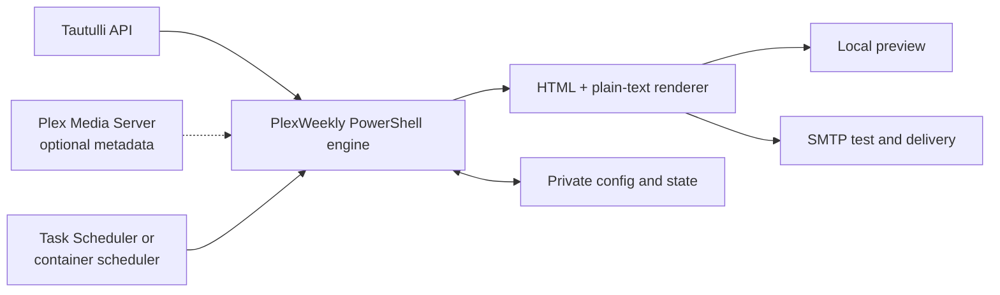

<div align="center">

# PlexWeekly

**A portable, preview-first weekly Plex activity newsletter powered by Tautulli.**

[](https://github.com/sparkmoxie/PlexWeekly/actions/workflows/ci.yml)
[](https://github.com/sparkmoxie/PlexWeekly/actions/workflows/pages.yml)
[](LICENSE)


Generate polished activity, welcome, quiet-week, and milestone emails; inspect
them locally; send controlled tests; then schedule production delivery.


[Documentation](docs/README.md) ·
[Releases](https://github.com/sparkmoxie/PlexWeekly/releases) ·
[Security](SECURITY.md) ·
[Contributing](CONTRIBUTING.md)

</div>

> [!WARNING]
> PlexWeekly configuration contains an SMTP credential and Tautulli API key,
> and may contain a Plex token. Never commit `config.json`, `.env`, state,
> logs, previews, generated newsletters, or backups. Preview first and use a
> controlled test recipient before enabling a schedule or `SendAll`.

## Choose a platform

| | Windows portable | NAS / Docker | macOS / Docker Desktop |
|---|---|---|---|
| Source baseline | 1.6.8 | 1.0.4 | 1.0.0 |
| Runtime | Windows PowerShell 5.1+ | PowerShell 7.2+ in Docker | PowerShell 7.2+ in Docker Desktop |
| Scheduler | Windows Task Scheduler | Built-in container scheduler | Built-in container scheduler |
| Preview | Local generated HTML | Port 8787, configurable bind | Localhost port 8787 by default |
| Best fit | Always-on Windows host | QNAP, Unraid, Linux NAS, Docker host | Intel or Apple silicon Mac |
| Install guide | [Windows](docs/windows/README.md) | [NAS / Docker](docs/nas-docker/README.md) | [macOS](docs/mac/README.md) |
| Source | [`platforms/windows`](platforms/windows) | [`platforms/nas-docker`](platforms/nas-docker) | [`platforms/mac-docker`](platforms/mac-docker) |

All three distributions preserve the supplied working renderer and safety
gates. Their setup and lifecycle wrappers are platform-specific.

## Installation at a glance

<details>
<summary><strong>Windows portable</strong></summary>

1. Download and extract `PlexWeekly-windows.zip` into a permanent writable
   folder.
2. Run `00-SETUP-FIRST.bat` and enter your own Tautulli and SMTP values.
3. Run `01-VERIFY-SETUP.bat`.
4. Preview with `03-PREVIEW-NEWSLETTER.bat`, then send a controlled test with
   `04-SEND-TEST.bat`.
5. Install the schedule only after review.

[Complete Windows guide](docs/windows/README.md)

</details>

<details>
<summary><strong>NAS / Docker Compose</strong></summary>

```bash
cp .env.example .env
docker compose build --pull
docker compose up -d
./plexweekly.sh setup
./plexweekly.sh verify
./plexweekly.sh preview-all
```

Use a hostname reachable from inside the container for Tautulli. Keep port
8787 on a trusted network and do not expose it publicly.

[Complete NAS / Docker guide](docs/nas-docker/README.md)

</details>

<details>
<summary><strong>macOS with Docker Desktop</strong></summary>

```bash
chmod +x INSTALL-MAC.command mac-install.sh plexweekly.sh
./mac-install.sh
./plexweekly.sh verify
./plexweekly.sh preview-all
```

The installer detects the host UID/GID and keeps previews on localhost by
default.

[Complete macOS guide](docs/mac/README.md)

</details>

## Architecture



Tautulli supplies users, activity, history, and recently added metadata. Direct
Plex access is optional and improves selected artwork and metadata fallbacks.
The renderer produces browser previews and multipart email, while local state
guards first-run behavior, welcomes, and repeat schedule attempts.

## Release downloads

Tagged releases publish unpacked source in this repository and three installable
archives:

| Platform | Published artifact | Download |
|---|---|---|
| Windows | `PlexWeekly-windows.zip` | [Open releases](https://github.com/sparkmoxie/PlexWeekly/releases) |
| NAS / Docker | `PlexWeekly-nas-docker.tar.gz` or `.zip` | [Open releases](https://github.com/sparkmoxie/PlexWeekly/releases) |
| macOS / Docker Desktop | `PlexWeekly-mac-docker.tar.gz` or `.zip` | [Open releases](https://github.com/sparkmoxie/PlexWeekly/releases) |
| Integrity manifest | `SHA256SUMS.txt` | [Open releases](https://github.com/sparkmoxie/PlexWeekly/releases) |

There is no `latest` download until the first version tag is published.

Verify a Windows download:

```powershell
Get-FileHash .\PlexWeekly-windows.zip -Algorithm SHA256
```

Verify Unix downloads from the release directory:

```bash
shasum -a 256 -c SHA256SUMS.txt
```

## Support matrix

| Environment | Support level | Validation |
|---|---|---|
| Windows 10/11, Windows PowerShell 5.1+ | Supported source target | PowerShell syntax validation on Windows CI |
| Docker Engine + Compose v2 on x86-64 or ARM64 Linux | Supported source target | Shell, JSON, and Compose validation; image build remains environment-dependent |
| QNAP Container Station / Unraid | Documented deployment | Uses the NAS Compose source; hardware-specific UI behavior is not CI-tested |
| Current Docker Desktop on Intel or Apple silicon macOS | Supported source target | Shell, JSON, and Compose validation; macOS UI flow is not CI-tested |
| PowerShell versions older than the platform minimum | Unsupported | Runtime guard exits with an explanatory error |

## Documentation

- [GitHub Pages source and documentation index](docs/README.md)
- [Windows installation](docs/windows/README.md)
- [NAS / Docker installation](docs/nas-docker/README.md)
- [macOS installation](docs/mac/README.md)
- [Configuration reference](docs/CONFIGURATION.md)
- [Security and hardening](docs/SECURITY.md)
- [Troubleshooting](docs/TROUBLESHOOTING.md)
- [Release process](docs/RELEASING.md)

## Project status and safety

The public repository begins from three previously packaged platform baselines.
Automation validates source hygiene and packaging, but it cannot validate your
Tautulli dataset, SMTP provider, Plex permissions, mail-client rendering, NAS
vendor UI, or network/firewall policy. Operate on a preview-and-test basis.

## License and affiliation

Original PlexWeekly source code and documentation are licensed under the
[MIT License](LICENSE). Bundled emoji and rating-service assets have separate
notices and ownership boundaries in [THIRD_PARTY_NOTICES.md](THIRD_PARTY_NOTICES.md).

PlexWeekly is an independent community project. It is not affiliated with,
endorsed by, or sponsored by Plex, Tautulli, IMDb, Rotten Tomatoes, Docker,
QNAP, Unraid, Apple, or Microsoft. All product names and marks belong to their
respective owners.
