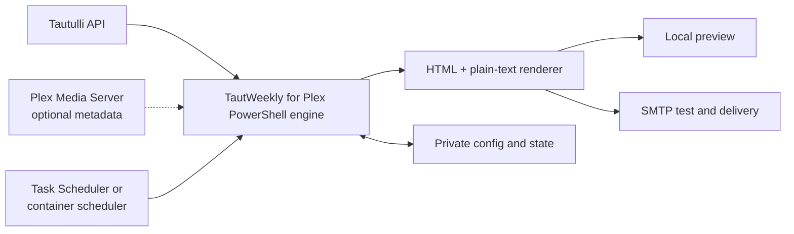

<div align="center">

# TautWeekly for Plex

**A portable, preview-first weekly Plex activity newsletter powered by Tautulli.**

[](https://github.com/sparkmoxie/TautWeekly/actions/workflows/ci.yml)
[](https://sparkmoxie.github.io/TautWeekly/)
[](LICENSE)


Generate polished activity, welcome, quiet-week, and milestone emails; inspect
them locally; send controlled tests; then schedule production delivery.


[Live documentation](https://sparkmoxie.github.io/TautWeekly/) ·
[Release downloads](#release-downloads) ·
[Security](SECURITY.md) ·
[Contributing](CONTRIBUTING.md)

</div>

> [!WARNING]
> TautWeekly for Plex configuration contains an SMTP credential and Tautulli API key,
> and may contain a Plex token. Never commit `config.json`, `.env`, state,
> logs, previews, generated newsletters, or backups. Preview first and use a
> controlled test recipient before enabling a schedule or `SendAll`.

> [!IMPORTANT]
> Scheduled weekly emails disclose the Binge Champion winner's Tautulli
> friendly name, qualifying-play count, and watch time to every newsletter
> recipient. One-off welcome emails do not include the award. Review the user
> roster, friendly names, and recipient expectations before production sends.

## Choose a platform

| | Windows portable | NAS / Docker | macOS / Docker Desktop |
|---|---|---|---|
| Source baseline | 1.6.11 | 1.1.0 | 1.0.3 |
| Runtime | Windows PowerShell 5.1+ | PowerShell 7.2+ in Docker | PowerShell 7.2+ in Docker Desktop |
| Scheduler | Windows Task Scheduler | Built-in container scheduler | Built-in container scheduler |
| Preview | Local generated HTML | Port 8787, configurable bind | Localhost port 8787 by default |
| Best fit | Always-on Windows host | QNAP, Unraid, Linux NAS, Docker host | Intel or Apple silicon Mac |
| Interactive walkthrough | [Open Windows](https://sparkmoxie.github.io/TautWeekly/windows/) | [Open NAS / Docker](https://sparkmoxie.github.io/TautWeekly/nas-docker/) | [Open macOS](https://sparkmoxie.github.io/TautWeekly/mac/) |
| Install guide | [Windows](docs/windows/README.md) | [NAS / Docker](docs/nas-docker/README.md) | [macOS](docs/mac/README.md) |
| Source | [`platforms/windows`](platforms/windows) | [`platforms/nas-docker`](platforms/nas-docker) | [`platforms/mac-docker`](platforms/mac-docker) |

All three distributions preserve the supplied working renderer and safety
gates. Their setup and lifecycle wrappers are platform-specific.

## Current newsletter behavior

- One to three watched movies render as itemized rows with a mini poster,
  title, formatted genres, and Rotten Tomatoes critic and audience scores.
- One to three streamed episodes render with show artwork, season/episode
  labels, episode titles, and IMDb scores. Four or more items use compact
  numeric cards.
- Binge Champion ranks qualifying activity by Plex user, breaks play-count
  ties by watch time, and emphasizes the winner's own newsletter.
- Trending remains a separate server-wide media-title feature with poster and
  exact play count; quiet-release hero layouts do not repeat it.
- The four personal-stat cards share a content-driven equal height, including
  zero-, one-, and multi-item states.

## Exclude newsletter recipients

Every primary setup wizard now loads the Tautulli user roster immediately
after the URL and API key are entered. Select one or more numbered rows (ranges
such as `2,4-6` are accepted), press Enter to keep the current selection, or
type `none` to clear it. The wizard stores stable Tautulli IDs in
`ExcludedUserIds`; it never copies a live roster into source files.

You can revise exclusions later without rerunning SMTP or schedule setup:

| Platform | Standalone command |
|---|---|
| Windows | `14-MANAGE-USER-EXCLUSIONS.bat` |
| NAS / Docker | `./tautweekly.sh exclude-users` |
| macOS / Docker Desktop | `./tautweekly.sh exclude-users` |

Excluded users are skipped by scheduled delivery and confirmed `SendAll`
runs. Preview and TestEmail modes can still use them as sample data, and an
administrator can still deliberately invoke the separately confirmed one-off
welcome command. The selector displays recipient names and email addresses;
do not share its output publicly.

## Installation at a glance

<details>
<summary><strong>Windows portable</strong></summary>

1. Download and extract
   [`TautWeekly-windows.zip`](https://github.com/sparkmoxie/TautWeekly/releases/latest/download/TautWeekly-windows.zip)
   into a permanent writable folder, or use
   [`platforms/windows`](platforms/windows) from the current source tree.
2. Run `00-SETUP-FIRST.bat`, enter your own Tautulli and SMTP values, and
   select any users to exclude from weekly delivery.
3. Run `01-VERIFY-SETUP.bat`.
4. Preview with `03-PREVIEW-NEWSLETTER.bat`, then send a controlled test with
   `04-SEND-TEST.bat`.
5. Install the schedule only after review.

[Open the rendered Windows walkthrough](https://sparkmoxie.github.io/TautWeekly/windows/)
· [Read the Markdown install guide](docs/windows/README.md)

</details>

<details>
<summary><strong>NAS / Docker Compose</strong></summary>

On Unraid, install **TautWeekly for Plex** from the Community Applications
Apps tab. The template uses `/mnt/user/appdata/tautweekly`, port `8787`, and
non-root Unraid defaults. After installation, open the container Console and
run:

```bash
pwsh -NoLogo -NoProfile -File /opt/tautweekly/Setup-First.ps1
pwsh -NoLogo -NoProfile -File /opt/tautweekly/Verify-Setup.ps1
```

The published image is available for 64-bit Intel/AMD and ARM hosts at
`ghcr.io/sparkmoxie/tautweekly:latest`.

For QNAP, use Container Station with the supplied
[`compose.qnap.yaml`](platforms/nas-docker/compose.qnap.yaml), or use the
guided release installer. QNAP App Center uses native QPKG packages, so the
Docker edition belongs in Container Station rather than App Center.

```bash
cp .env.example .env
docker compose pull
docker compose up -d
./tautweekly.sh setup
./tautweekly.sh verify
./tautweekly.sh exclude-users  # optional later revision
./tautweekly.sh preview-all
```

Use a hostname reachable from inside the container for Tautulli. Keep port
8787 on a trusted network and do not expose it publicly.

[Open the rendered NAS / Docker walkthrough](https://sparkmoxie.github.io/TautWeekly/nas-docker/)
· [Open the rendered Compose quick start](https://sparkmoxie.github.io/TautWeekly/nas-docker/quickstart.html)
· [Read the Markdown install guide](docs/nas-docker/README.md)

</details>

<details>
<summary><strong>macOS with Docker Desktop</strong></summary>

```bash
chmod +x INSTALL-MAC.command mac-install.sh tautweekly.sh
./mac-install.sh
./tautweekly.sh verify
./tautweekly.sh exclude-users  # optional later revision
./tautweekly.sh preview-all
```

The installer detects the host UID/GID and keeps previews on localhost by
default.

[Open the rendered macOS walkthrough](https://sparkmoxie.github.io/TautWeekly/mac/)
· [Read the Markdown install guide](docs/mac/README.md)

</details>

## Architecture



Tautulli supplies users, activity, history, and recently added metadata. Direct
Plex access is optional and improves selected artwork and metadata fallbacks.
The renderer produces browser previews and multipart email, while local state
guards first-run behavior, welcomes, and repeat schedule attempts.

## Release downloads

TautWeekly for Plex `v0.3.0` publishes five installable archives, a checksum
manifest, and the multi-architecture NAS image.
The stable links below follow the latest published release.

> [!NOTE]
> Preserve private configuration and Docker `data` during upgrades. The
> published container and Unraid template never contain live credentials.

| Platform | Published artifact | Download |
|---|---|---|
| Windows | `TautWeekly-windows.zip` | [ZIP](https://github.com/sparkmoxie/TautWeekly/releases/latest/download/TautWeekly-windows.zip) |
| NAS / Docker | `TautWeekly-nas-docker.tar.gz` or `.zip` | [TAR.GZ](https://github.com/sparkmoxie/TautWeekly/releases/latest/download/TautWeekly-nas-docker.tar.gz) · [ZIP](https://github.com/sparkmoxie/TautWeekly/releases/latest/download/TautWeekly-nas-docker.zip) |
| macOS / Docker Desktop | `TautWeekly-mac-docker.tar.gz` or `.zip` | [TAR.GZ](https://github.com/sparkmoxie/TautWeekly/releases/latest/download/TautWeekly-mac-docker.tar.gz) · [ZIP](https://github.com/sparkmoxie/TautWeekly/releases/latest/download/TautWeekly-mac-docker.zip) |
| Integrity manifest | `SHA256SUMS.txt` | [SHA-256 checksums](https://github.com/sparkmoxie/TautWeekly/releases/latest/download/SHA256SUMS.txt) |
| NAS container | `ghcr.io/sparkmoxie/tautweekly:latest` | [GHCR package](https://github.com/sparkmoxie/TautWeekly/pkgs/container/tautweekly) |

[Read the latest release notes](https://github.com/sparkmoxie/TautWeekly/releases/latest)
and verify every archive before installation.

Verify a Windows download:

```powershell
Get-FileHash .\TautWeekly-windows.zip -Algorithm SHA256
```

Verify Unix downloads from the release directory:

```bash
shasum -a 256 -c SHA256SUMS.txt
```

## Support matrix

| Environment | Support level | Validation |
|---|---|---|
| Windows 10/11, Windows PowerShell 5.1+ | Supported source target | PowerShell syntax validation on Windows CI |
| Docker Engine + Compose v2 on x86-64 or ARM64 Linux | Supported image and source target | Multi-architecture image build, shell, JSON, and Compose validation |
| Unraid 6.12+ | Community Applications target | Official v2 template plus amd64/arm64 image; catalog publication is moderated by Unraid |
| QNAP Container Station | Documented Compose deployment | Pull-based Container Station application; QPKG/App Center packaging is not applicable to this Docker distribution |
| Current Docker Desktop on Intel or Apple silicon macOS | Supported source target | Shell, JSON, and Compose validation; macOS UI flow is not CI-tested |
| PowerShell versions older than the platform minimum | Unsupported | Runtime guard exits with an explanatory error |

## Documentation

- [Live GitHub Pages documentation](https://sparkmoxie.github.io/TautWeekly/)
- [Rendered Windows walkthrough](https://sparkmoxie.github.io/TautWeekly/windows/)
- [Rendered NAS / Docker walkthrough](https://sparkmoxie.github.io/TautWeekly/nas-docker/)
- [Rendered NAS / Docker Compose quick start](https://sparkmoxie.github.io/TautWeekly/nas-docker/quickstart.html)
- [Rendered macOS walkthrough](https://sparkmoxie.github.io/TautWeekly/mac/)
- [Documentation source index](docs/README.md)
- [Windows installation](docs/windows/README.md)
- [NAS / Docker installation](docs/nas-docker/README.md)
- [macOS installation](docs/mac/README.md)
- [Configuration reference](docs/CONFIGURATION.md)
- [Security and hardening](docs/SECURITY.md)
- [Troubleshooting](docs/TROUBLESHOOTING.md)
- [Release process](docs/RELEASING.md)

## Project status and safety

The public repository begins from three previously packaged platform baselines.
Automation validates source hygiene and packaging, but it cannot validate your
Tautulli dataset, SMTP provider, Plex permissions, mail-client rendering, NAS
vendor UI, or network/firewall policy. Operate on a preview-and-test basis.

## License and affiliation

TautWeekly for Plex source code, documentation, and bundled custom artwork are licensed
under the [MIT License](LICENSE). Asset provenance is recorded in
[THIRD_PARTY_NOTICES.md](THIRD_PARTY_NOTICES.md).

TautWeekly for Plex is an independent community project. It is not affiliated with,
endorsed by, or sponsored by Plex, Tautulli, IMDb, Rotten Tomatoes, Docker,
QNAP, Unraid, Apple, or Microsoft. All product names and marks belong to their
respective owners.
