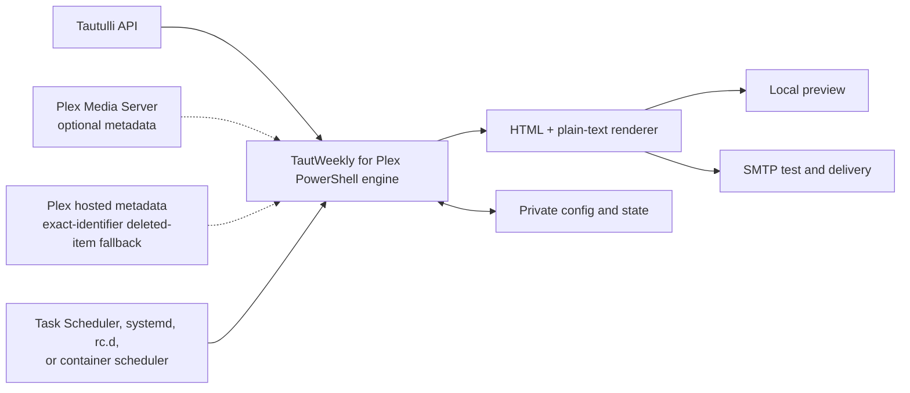

<div align="center">


# TautWeekly for Plex

**A portable, preview-first weekly Plex activity newsletter powered by Tautulli.**

[](https://github.com/sparkmoxie/TautWeekly/actions/workflows/ci.yml)
[](https://sparkmoxie.github.io/TautWeekly/)
[](LICENSE)


[](https://sparkmoxie.github.io/TautWeekly/nas-docker/#unraid)


Generate polished activity, welcome, quiet-week, and milestone emails; inspect
them locally; send controlled tests; then schedule production delivery.


[TautWeekly Quickstart](https://sparkmoxie.github.io/TautWeekly/) ·
[Email States Preview](https://sparkmoxie.github.io/TautWeekly/examples/preview-all-00-INDEX.html) ·
[Release downloads](#release-downloads) ·
[Security](SECURITY.md) ·
[Contributing](CONTRIBUTING.md) ·
[Contributors](CONTRIBUTORS.md)

</div>

> [!WARNING]
> TautWeekly for Plex configuration contains an SMTP credential and Tautulli API key,
> and may contain a Plex token. Never commit `config.json`, `.env`, state,
> logs, previews, generated newsletters, or backups. Preview first and use a
> controlled test recipient before enabling a schedule or `SendAll`. The
> verifier checks SMTP reachability, not authentication or sender permission;
> a successful `SendTest` is the mail-delivery acceptance check.

> [!CAUTION]
> Deleted-item recovery added through v0.8.3 is best-effort. Tautulli history
> may retain GUIDs, rating keys, titles, years, and episode indexes, but its
> normal history rows do not preserve durable poster bytes, and deleting the
> Plex item can invalidate the referenced asset. TautWeekly cannot reliably
> reconstruct metadata or artwork that Plex and Tautulli already discarded.
> v0.9.0 therefore caches a small bounded presentation record while an item is
> still live. It protects future deletions after the cache has been populated;
> it does not retroactively repair already-deleted items and never title-matches
> a missing or ambiguous identifier.

> [!IMPORTANT]
> Scheduled weekly emails share an anonymous Binge Champion aggregate with
> every recipient: total watch time plus nonzero unique movie and TV-show counts.
> The user with the most qualifying watch time wins; total plays break an exact
> tie. Only the winner receives the gold **YOU WON** treatment. Friendly names,
> usernames, IDs, and titles are never disclosed by the award, and one-off
> welcome emails do not include it.

## Choose a platform

| Platform | Runtime and scheduler | Preview | Best fit | Guides and source |
|---|---|---|---|---|
| Windows portable · baseline 1.8.0 | Windows PowerShell 5.1+ · Task Scheduler | Local generated HTML | Always-on Windows host | [Quickstart](https://sparkmoxie.github.io/TautWeekly/windows/) · [Documentation](docs/windows/README.md) · [Source](platforms/windows) |
| NAS / Docker · baseline 1.3.0 | PowerShell 7 in Docker · internal scheduler | Configurable port 8787 bind | QNAP, Unraid, Linux NAS, Docker host | [Quickstart](https://sparkmoxie.github.io/TautWeekly/nas-docker/) · [Unraid Apps](https://ca.unraid.net/apps/tautweekly-for-plex-16l668j1jpt7jb) · [Documentation](docs/nas-docker/README.md) · [Source](platforms/nas-docker) |
| macOS · baseline 1.2.0 | PowerShell 7 in Docker Desktop · internal scheduler | Localhost port 8787 by default | Intel or Apple silicon Mac | [Quickstart](https://sparkmoxie.github.io/TautWeekly/mac/) · [Documentation](docs/mac/README.md) · [Source](platforms/mac-docker) |
| Native Linux · baseline 1.1.0 | PowerShell 7.2+ · hardened systemd service | Localhost port 8787 by default | Current Ubuntu, Debian, or RHEL host without Docker | [Quickstart](https://sparkmoxie.github.io/TautWeekly/linux/) · [Documentation](docs/linux/README.md) · [Source](platforms/linux) |
| FreeBSD Podman · baseline 1.1.0 | Maintained Linux OCI renderer · rc.d | Localhost port 8787 by default | FreeBSD 15.1+ amd64 host · **beta** | [Quickstart](https://sparkmoxie.github.io/TautWeekly/freebsd/) · [Documentation](docs/freebsd/README.md) · [Source](platforms/freebsd-podman) |

All five distributions preserve the working renderer and safety gates. Their
setup, storage, scheduling, and lifecycle wrappers remain platform-specific.

## Current newsletter behavior

- Movies prefer Rotten Tomatoes critic/audience ratings across every supported
  Plex and Tautulli source. A provider-labelled IMDb score is used only when no
  RT value is available. TV release episode rows display only IMDb scores tied
  to the exact episode; show, TMDB, and TVDB scores are not substituted.
- Direct item metadata explicitly requests Plex's optional `Rating` element.
  This matters when Tautulli returns only the selected/flattened IMDb or TMDB
  value: an available alternate RT pair or exact-episode IMDb value can still
  be recovered from the configured Plex server.
- To intentionally publish movie RT scores, each Plex Movie library must use
  **Edit → Advanced → Ratings Source → Rotten Tomatoes** and have refreshed
  metadata; Plex documents that choice as library-wide.
  If IMDb or TMDB is deliberately selected, TautWeekly preserves that labelled
  movie score as the fallback rather than inventing an RT value.
  Unlabeled and unknown-provider values remain omitted.
- Tautulli remains the required activity source, but direct Plex is recommended
  for the complete alternate rating set, exact-episode metadata, backgrounds,
  and selected logos. Every setup wizard explains this boundary. The platform
  verifier tests the resolved Plex URL/token with token-safe identity and
  authenticated-library requests; an unreachable configured connection fails
  verification before Preview or SendTest.
- A private pre-deletion cache stores only the minimum reusable presentation
  record for a live item: exact stable GUID and media type, title/year/summary,
  up to eight genres, displayed ratings, one poster, hashes, and timestamps.
  It excludes watch history, recipient data, credentials, and generated mail.
- Cache cleanup runs deterministically on initialization and update. Defaults
  are 365 days, 1,000 items, and 256 MiB total; the oldest entries are removed
  first when any limit is reached. The cache is exact-ID only and does not
  silently match an already-deleted item by title.

- Personal stats list up to four most-watched movie titles and four
  most-watched TV shows, ranked by qualifying watch time. Episodes are grouped
  under their show, and the TV card is omitted when no TV show was watched.
- The packaged `movies.gif` and `tv.gif` artwork is CID-embedded through the
  same repair and delivery pipeline as the other animated email icons.
- Binge Champion ranks Plex users by qualifying watch time, breaks exact-time
  ties by total plays, and shows every recipient the same anonymous two-line
  metric: **4h 18m watched**, followed by **5 movies • 1 TV show**. Zero-count
  media categories are omitted. Only the winner's card turns gold.
- Total Watched shows duration only; qualifying-play copy is intentionally
  omitted from the personal recap.
- **HOT NEW RELEASE** considers only newly added movies. If no new movie was
  added, the hero falls back to **TRENDING THIS WEEK** while any new TV titles
  remain listed in the New Releases section.
- Trending remains a separate server-wide media-title feature with poster and
  exact play count; layouts that promote Trending into the hero do not repeat
  the compact Trending card.

### Persistent deleted-item cache

The cache lives at `cache/deleted-items` beside the Windows application and
under the private data root on every other platform (`/data`,
`/var/lib/tautweekly`, or `/var/db/tautweekly`). Existing v0.8.x configurations
need no manual migration: missing settings use the bounded defaults. Setup and
upgrade paths preserve the directory and any explicit controls.

The cache is private runtime data. Include it in private backups if future
deleted-item rendering matters, but never commit or attach it to a public
support request. Disabling `DeletedItemCacheEnabled` stops reads and writes
without deleting existing entries. To purge it, stop TautWeekly, remove only
the platform's `cache/deleted-items` directory, and restart; the directory is
recreated empty. Full uninstall may remove the entire private data root only
after configuration, state, output, and backups are no longer needed. See the
[configuration reference](docs/CONFIGURATION.md#persistent-deleted-item-cache)
for limits and the [security guide](docs/SECURITY.md#deleted-item-cache).

## Choose the newsletter libraries

Primary setup queries Tautulli's `get_libraries` endpoint and lists each active
movie and TV library. Choose one or more numbered rows, ranges such as `1,3-4`,
or `all`. The stable section IDs are stored in `IncludedLibraryIds` and define
one global newsletter scope.

The renderer applies that scope before calculating new/latest releases, quiet
mode, Trending, the hero, Binge Champion, and each recipient's personal stats.
Each selected section is queried independently and every returned row is
checked against its requested section before use. This prevents a busy
unselected admin-only library from affecting calculations or crowding selected
releases out of paged API results. The existing algorithms and privacy
treatment remain unchanged. An absent or empty `IncludedLibraryIds` retains
the legacy all-library behavior for upgraded configurations.

Revise the scope later without rerunning SMTP or schedule setup:

| Platform | List | Update |
|---|---|---|
| Windows | `16-LIST-LIBRARIES.bat` | `15-MANAGE-LIBRARIES.bat` |
| NAS / Docker and macOS | `./tautweekly.sh list-libraries` | `./tautweekly.sh manage-libraries` |
| Native Linux | `sudo tautweekly list-libraries` | `sudo tautweekly manage-libraries` |
| FreeBSD / Podman | `sudo tautweekly list-libraries` | `sudo tautweekly manage-libraries` |

For NAS / Docker, `./tautweekly.sh` is the host-side Compose wrapper from the
release archive; it is not installed inside the container. Unraid Apps users
should use the direct Console commands in the [NAS / Docker guide](docs/nas-docker/README.md#install-from-unraid-apps).

## Exclude newsletter recipients

Every primary setup wizard now loads the Tautulli user roster immediately
after the URL and API key are entered. Select one or more numbered rows (ranges
such as `2,4-6` are accepted), press Enter to keep the current selection, or
type `none` to clear it. The wizard stores stable Tautulli IDs in
`ExcludedUserIds`; it never copies a live roster into source files.

The selector merges Tautulli's `get_user_names` and `get_users` bulk responses
by stable user ID. It does not issue one API request per user, and a user from
the name roster remains selectable if Tautulli omits that user's detailed row.

You can revise exclusions later without rerunning SMTP or schedule setup:

| Platform | Standalone command |
|---|---|
| Windows | `14-MANAGE-USER-EXCLUSIONS.bat` |
| NAS / Docker | `./tautweekly.sh exclude-users` |
| macOS / Docker Desktop | `./tautweekly.sh exclude-users` |
| Native Linux | `sudo tautweekly exclude-users` |
| FreeBSD / Podman | `sudo tautweekly exclude-users` |

Excluded users are skipped by scheduled delivery and confirmed `SendAll`
runs. Preview and TestEmail modes can still use them as sample data, and an
administrator can still deliberately invoke the separately confirmed one-off
welcome command. The selector displays recipient names and email addresses;
do not share its output publicly.

## Installation at a glance

Where a command shows `USER_ID`, replace it with the numeric value from the
platform's `list-users` command. Listing users is informational; it does not
select or save a default user.

<details>
<summary><strong>Windows portable</strong></summary>

1. Download and extract
   [`TautWeekly-windows.zip`](https://github.com/sparkmoxie/TautWeekly/releases/latest/download/TautWeekly-windows.zip)
   into a permanent writable folder, or use
   [`platforms/windows`](platforms/windows) from the current source tree.
2. Run `00-SETUP-FIRST.bat`, enter your own Tautulli and SMTP values, choose
   the movie/TV libraries to include, and select any users to exclude.
3. Run `01-VERIFY-SETUP.bat`.
4. Preview with `03-PREVIEW-NEWSLETTER.bat`, then send a controlled test with
   `04-SEND-TEST.bat`.
5. Install the schedule only after review.

[Open the Windows Quickstart](https://sparkmoxie.github.io/TautWeekly/windows/)
· [Read the Windows documentation](docs/windows/README.md)

</details>

<details>
<summary><strong>Native Linux with systemd</strong></summary>

Install PowerShell 7.2 or newer from Microsoft's supported repository for your
distribution, download and verify the Linux release, then run:

```bash
sudo ./install-linux.sh
sudo tautweekly setup
sudo tautweekly verify
sudo tautweekly exclude-users
sudo tautweekly list-users
sudo tautweekly preview-all USER_ID
sudo tautweekly send-test-all USER_ID
```

Application code is root-owned under `/opt/tautweekly`; configuration, state,
logs, previews, custom assets, and backups stay in the protected
`/var/lib/tautweekly` data directory. The preview listener defaults to
localhost.

[Open the Native Linux Quickstart](https://sparkmoxie.github.io/TautWeekly/linux/)
· [Read the Native Linux documentation](docs/linux/README.md)

</details>

<details>
<summary><strong>FreeBSD with Podman</strong></summary>

The initial beta supports FreeBSD 15.1+ on amd64. It uses FreeBSD's documented
Podman Linux-container path and native rc.d lifecycle rather than an unsupported
native PowerShell build:

```sh
sudo ./install-freebsd.sh
sudo tautweekly setup
sudo tautweekly verify
sudo tautweekly exclude-users
sudo tautweekly list-users
sudo tautweekly preview-all USER_ID
sudo tautweekly send-test-all USER_ID
```

Private runtime data remains under `/var/db/tautweekly`; the public GHCR image
contains no live configuration. Keep previews on localhost and complete the
full acceptance sequence on the FreeBSD host before scheduling.

[Open the FreeBSD Podman Quickstart](https://sparkmoxie.github.io/TautWeekly/freebsd/)
· [Read the FreeBSD Podman documentation](docs/freebsd/README.md)

</details>

<details>
<summary><strong>NAS / Docker</strong></summary>

On Unraid, follow the [Unraid Apps section of the NAS/Docker/QNAP/Unraid
Quickstart](https://sparkmoxie.github.io/TautWeekly/nas-docker/#unraid).
The template uses `/mnt/user/appdata/tautweekly`, port `8787`, and
non-root Unraid defaults. After installation, open the container Console and
run:

```bash
/opt/tautweekly/bin/run-script.sh Setup-First.ps1
/opt/tautweekly/bin/run-script.sh Verify-Setup.ps1
```

Use the supplied launcher for all Console commands. Docker exec sessions begin
as root; the launcher repairs legacy root-owned entries under `/data`, then
runs TautWeekly as the configured non-root PUID/PGID.

The published image is available for 64-bit Intel/AMD and ARM hosts at
`ghcr.io/sparkmoxie/tautweekly:latest`.

Port 8787 is a read-only preview viewer, not an administration Web UI. Its
landing page confirms the preview service is online and shows the first-run
commands. Setup writes the required persistent configuration to
`/data/config.json`; automatic delivery remains disabled until explicitly
enabled.

Container liveness uses a dedicated service-supervisor heartbeat, so a long
scheduled delivery does not make a working service appear unhealthy. Missing
decorative preview artwork emits a repair warning; a stopped preview listener
or stalled supervisor remains a health failure with an explicit reason.

For QNAP, use Container Station with the supplied
[`compose.qnap.yaml`](platforms/nas-docker/compose.qnap.yaml), or use the
guided release installer. QNAP App Center uses native QPKG packages, so the
Docker edition belongs in Container Station rather than App Center.

```bash
cp .env.example .env
docker compose pull
docker compose up -d
./tautweekly.sh setup
./tautweekly.sh verify
./tautweekly.sh exclude-users  # optional later revision
./tautweekly.sh list-users
./tautweekly.sh preview-all USER_ID
```

Run this block from the extracted release directory on the Docker host, not
from a container Console. The Unraid Apps path above uses container-native
commands because Community Applications does not install the host wrapper.

Use a hostname reachable from inside the container for Tautulli. Keep port
8787 on a trusted network and do not expose it publicly.

[Open the NAS/Docker/QNAP/Unraid Quickstart](https://sparkmoxie.github.io/TautWeekly/nas-docker/)
· [Open the Unraid Apps instructions](https://sparkmoxie.github.io/TautWeekly/nas-docker/#unraid)
· [Read the NAS / Docker documentation](docs/nas-docker/README.md)

</details>

<details>
<summary><strong>macOS with Docker Desktop</strong></summary>

```bash
chmod +x INSTALL-MAC.command mac-install.sh tautweekly.sh mac-update.sh check-release.sh
./mac-install.sh
./tautweekly.sh verify
./tautweekly.sh exclude-users  # optional later revision
./tautweekly.sh list-users
./tautweekly.sh preview-all USER_ID
```

The installer detects the host UID/GID and keeps previews on localhost by
default. Docker health uses the same supervisor-based probe as the NAS edition,
so long sends do not interrupt liveness reporting.

[Open the macOS Quickstart](https://sparkmoxie.github.io/TautWeekly/mac/)
· [Read the macOS documentation](docs/mac/README.md)

</details>

## Update policy

Stable releases only by default. TautWeekly never installs unattended updates
by default. A check or prompt never applies an update without explicit
confirmation. `latest` and semantic version tags are stable release channels;
`edge` follows GitHub `main` and is not used by any packaged default. A check
reports or stages a stable candidate, while an update/apply action changes the
installed runtime.

| Package | Check for a stable update | Apply and recover |
|---|---|---|
| Windows portable | Run `17-CHECK-FOR-UPDATE.bat`; it checks GitHub's latest stable release and, when one exists, offers an explicit safe-update choice. No periodic checker or unattended updater is installed. | Choose `U` to download the official Windows ZIP and `SHA256SUMS.txt`, verify the checksum and per-file release manifest, refuse concurrent newsletter work, pause Task Scheduler, create a private sibling backup, replace only release-owned files, remove only unchanged deprecated release files, verify version/syntax, and restore the task. Failure triggers automatic rollback; unowned config, state, logs, output, and custom-named assets stay in place. |
| NAS Compose / QNAP | Run `./tautweekly.sh check-update`; Docker pulls the configured stable image into the host cache but leaves the running container unchanged. | Run `./tautweekly.sh update`; it refuses a busy newsletter operation, recreates from the stable image, verifies health/version, preserves `data/`, and automatically restores the prior image if health fails. |
| Unraid host-managed | Unraid's Apps Action Center reports when the configured `latest` image digest changes. | Apply from Unraid's Docker/Apps controls. Automatic application is an explicit administrator choice through an optional update plugin; TautWeekly adds no Docker socket or in-container updater. |
| macOS Docker Desktop | Run `./tautweekly.sh check-update`; it compares the package's release metadata with GitHub's latest stable release. | Download and checksum the newer Mac archive, overlay it on the existing project without deleting `.env` or `data/`, then run `./tautweekly.sh update`. The wrapper builds that verified package, checks the operation lock and container health/version, and rolls back the image on failure. |
| Native Linux | Run `tautweekly check-update`; it is a read-only GitHub stable-release check. | Download and checksum the Linux archive, then run `sudo ./install-linux.sh --upgrade`. The installer locks against sends, backs up `/opt/tautweekly`, preserves `/var/lib/tautweekly`, and verifies the installed release/service; the program archive is the rollback source. |
| FreeBSD / Podman | Run `sudo tautweekly check-update`; Podman pulls the configured stable image into local storage without restarting the container. | Run `sudo tautweekly update`; the rc.d-aware wrapper checks the operation lock, restarts, verifies health/version, and retags/restarts the prior image on failure. Podman's systemd-only auto-update service is not used on FreeBSD. |

Read the platform guide before updating. Backups contain credentials and must
remain private. After any successful update, run `verify`, controlled previews,
and TestEmail delivery before trusting the next production send.

## Architecture



Tautulli supplies users, activity, history, and recently added metadata. Direct
Plex access is optional and improves selected artwork and metadata fallbacks.
If a Plex item has been deleted but Tautulli retains its exact media GUID, the
configured administrator Plex token can resolve that identifier through Plex's
hosted metadata service. Plex's matching contract also receives only the retained
movie/show title, optional movie year, or TV season/episode indexes needed to
resolve that GUID; TautWeekly rejects any response whose returned canonical or
external identifier conflicts with the retained identifier. When Plex omits an
external-ID array from an exact TMDB/TVDB/IMDb lookup response, the retained
title and media type must also agree. TautWeekly sends no recipient identity or
viewing metrics, and it never forwards the token to external artwork hosts.
The renderer produces browser previews and multipart email, while local state
guards first-run behavior, welcomes, and repeat schedule attempts.

## Release downloads

Tagged releases publish nine installable archives, a checksum manifest, and the
multi-architecture OCI image used by NAS and FreeBSD deployments.
The stable links below follow the latest published release.

> [!NOTE]
> Preserve private configuration and Docker `data` during upgrades. The
> published container and Unraid template never contain live credentials.

| Platform | Published artifact | Download |
|---|---|---|
| Windows | `TautWeekly-windows.zip` | [ZIP](https://github.com/sparkmoxie/TautWeekly/releases/latest/download/TautWeekly-windows.zip) |
| NAS / Docker | `TautWeekly-nas-docker.tar.gz` or `.zip` | [TAR.GZ](https://github.com/sparkmoxie/TautWeekly/releases/latest/download/TautWeekly-nas-docker.tar.gz) · [ZIP](https://github.com/sparkmoxie/TautWeekly/releases/latest/download/TautWeekly-nas-docker.zip) |
| macOS / Docker Desktop | `TautWeekly-mac-docker.tar.gz` or `.zip` | [TAR.GZ](https://github.com/sparkmoxie/TautWeekly/releases/latest/download/TautWeekly-mac-docker.tar.gz) · [ZIP](https://github.com/sparkmoxie/TautWeekly/releases/latest/download/TautWeekly-mac-docker.zip) |
| Native Linux | `TautWeekly-linux.tar.gz` or `.zip` | [TAR.GZ](https://github.com/sparkmoxie/TautWeekly/releases/latest/download/TautWeekly-linux.tar.gz) · [ZIP](https://github.com/sparkmoxie/TautWeekly/releases/latest/download/TautWeekly-linux.zip) |
| FreeBSD / Podman | `TautWeekly-freebsd-podman.tar.gz` or `.zip` | [TAR.GZ](https://github.com/sparkmoxie/TautWeekly/releases/latest/download/TautWeekly-freebsd-podman.tar.gz) · [ZIP](https://github.com/sparkmoxie/TautWeekly/releases/latest/download/TautWeekly-freebsd-podman.zip) |
| Integrity manifest | `SHA256SUMS.txt` | [SHA-256 checksums](https://github.com/sparkmoxie/TautWeekly/releases/latest/download/SHA256SUMS.txt) |
| NAS container | `ghcr.io/sparkmoxie/tautweekly:latest` | [GHCR package](https://github.com/sparkmoxie/TautWeekly/pkgs/container/tautweekly) |

[Read the latest release notes](https://github.com/sparkmoxie/TautWeekly/releases/latest)
and verify every archive before installation.

Verify a Windows download:

```powershell
Get-FileHash .\TautWeekly-windows.zip -Algorithm SHA256
```

Verify Unix downloads from the release directory:

```bash
shasum -a 256 -c SHA256SUMS.txt
```

## Support matrix

| Environment | Support level | Validation |
|---|---|---|
| Windows 10/11, Windows PowerShell 5.1+ | Supported source target | PowerShell syntax validation on Windows CI |
| Docker Engine + Compose v2 on x86-64 or ARM64 Linux | Supported image and source target | Multi-architecture image build, shell, JSON, and Compose validation |
| Unraid 6.12+ | Published Community Applications listing | Official v2 template plus amd64/arm64 image; follow the [NAS/Docker/QNAP/Unraid Quickstart](https://sparkmoxie.github.io/TautWeekly/nas-docker/#unraid) |
| QNAP Container Station | Documented Compose deployment | Pull-based Container Station application; QPKG/App Center packaging is not applicable to this Docker distribution |
| Current Docker Desktop on Intel or Apple silicon macOS | Supported source target | Shell, JSON, and Compose validation; macOS UI flow is not CI-tested |
| Current PowerShell-supported Ubuntu, Debian, or RHEL with systemd | Supported native source target | PowerShell, shell, data-boundary, systemd-contract, archive, and link validation; distro package-manager UI is not CI-tested |
| FreeBSD 15.1+ amd64 with Podman Linux containers | Beta source target | POSIX shell, rc.d-contract, archive, and shared OCI validation; a real FreeBSD host is required for acceptance |
| PowerShell versions older than the platform minimum | Unsupported | Runtime guard exits with an explanatory error |

## Interactive Quickstart Guides

- [TautWeekly Quickstart](https://sparkmoxie.github.io/TautWeekly/)
- [Windows Quickstart](https://sparkmoxie.github.io/TautWeekly/windows/)
- [NAS/Docker/QNAP/Unraid Quickstart](https://sparkmoxie.github.io/TautWeekly/nas-docker/)
- [macOS Quickstart](https://sparkmoxie.github.io/TautWeekly/mac/)
- [Native Linux Quickstart](https://sparkmoxie.github.io/TautWeekly/linux/)
- [FreeBSD Podman Quickstart](https://sparkmoxie.github.io/TautWeekly/freebsd/)

## Documentation

- [Documentation source index](https://github.com/sparkmoxie/TautWeekly/blob/main/docs/README.md)
- [Windows installation](https://github.com/sparkmoxie/TautWeekly/blob/main/docs/windows/README.md)
- [NAS / Docker installation](https://github.com/sparkmoxie/TautWeekly/blob/main/docs/nas-docker/README.md)
- [macOS installation](https://github.com/sparkmoxie/TautWeekly/blob/main/docs/mac/README.md)
- [Native Linux installation](https://github.com/sparkmoxie/TautWeekly/blob/main/docs/linux/README.md)
- [FreeBSD Podman installation](https://github.com/sparkmoxie/TautWeekly/blob/main/docs/freebsd/README.md)
- [Configuration reference](https://github.com/sparkmoxie/TautWeekly/blob/main/docs/CONFIGURATION.md)
- [Security and hardening](https://github.com/sparkmoxie/TautWeekly/blob/main/docs/SECURITY.md)
- [Troubleshooting](https://github.com/sparkmoxie/TautWeekly/blob/main/docs/TROUBLESHOOTING.md)
- [Release process](https://github.com/sparkmoxie/TautWeekly/blob/main/docs/RELEASING.md)

## Project status and safety

The public repository began from three packaged platform baselines and now also
maintains native Linux and FreeBSD Podman lifecycle distributions.
Automation validates source hygiene and packaging, but it cannot validate your
Tautulli dataset, SMTP provider, Plex permissions, mail-client rendering, NAS
vendor UI, or network/firewall policy. Operate on a preview-and-test basis.

## License and affiliation

TautWeekly for Plex source code, documentation, and bundled custom artwork are licensed
under the [MIT License](LICENSE). Asset provenance is recorded in
[THIRD_PARTY_NOTICES.md](THIRD_PARTY_NOTICES.md).

TautWeekly for Plex is an independent community project. It is not affiliated with,
endorsed by, or sponsored by Plex, Tautulli, IMDb, Rotten Tomatoes, Docker,
QNAP, Unraid, Apple, Microsoft, Red Hat, Debian, Canonical, or the FreeBSD
Project. All product names and marks belong to their respective owners.
